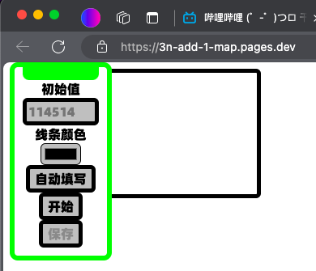

# 3n+1Map——3n+1曲线图快速生成工具
## 3n+1 猜想简介

3n+1猜想，又称为Collatz猜想或者Syracuse问题，是由Lothar Collatz在1937年提出的。这是一个涉及正整数的迭代过程，并且至今尚未得到证明或反驳。尽管这个猜想看似简单，但它的复杂性和未解之谜使得它成为数学家们长期研究的对象。

### 迭代规则
对于任意正整数 \( n \)，按照以下规则进行迭代：
1. 如果 \( n \) 是偶数，则计算 \( n / 2 \)；
2. 如果 \( n \) 是奇数，则计算 \( 3n + 1 \)。

### 猜想内容
无论初始值 \( n \) 多大，通过反复应用上述规则，最终序列会进入循环 \( 4, 2, 1 \) 并无限重复。

### 研究进展
虽然这个猜想对许多数字进行了验证，但它仍然没有得到严格的数学证明。许多数学家尝试过证明这个猜想，但都没有成功。3n+1猜想的简单表述与它的复杂性形成了鲜明对比，使其成为了一个非常有趣的数学难题。

## 关于
### 里程碑式意义
这个工具是我制作的第一个正式Web应用。
### 成分
由29行HTML，161行JavaScript以及59行CSS构成。
使用VS Code，Tabnine AI，以及 阿里-通义千问AI 完成开发，总耗时约5小时。
### 开发过程
开发过程中，整个CSS重构了1次，可以在目录中找到重构前的文件styleOld.css。
dragForm.js文件由AI（阿里-通义千问）做初步填充。
script.js中的DrawByAI函数由 通义AI 完成。setCanvas函数由 通义AI 改进。

开发过程中 TabnineAI 和 通义AI 全力协助，帮助我完成了这个应用。（包括上面的 3n+1猜想简介 也是 通义AI 生成的）

## 应用介绍
这个应用可以根据设定的初始值 计算并绘制 3n+1猜想的曲线图。

你可以：
- 把表单拖动到你想要的位置
- 自定义初始值
- 设置绘制时线条的颜色
- 重现上一次的数据
- 欣赏曲线图
- 在控制台看到所有的数值
- 保存曲线图
- 顺便看一下作者的 哔哩哔哩空间

## 如何使用
访问
[3n+1Map](https://3n-add-1-map.pages.dev/)
，你会看到这样一个页面

按下“自动填写”按钮，表单会被填写上一次输入的内容。
如果是刚加载的页面，则会自动填充预设的数据。

或者觉得表单挡住了后面的画布，你完全可以把它拖动到其他位置

你可以按下“自动填写”按钮来启用预设，或者自己输入

然后点击“开始”。你的图形会在0.1秒内生成

这个时候你会发现“保存”按钮启用了，点击它，这张图片就会被下载下来

当你打开控制台，你就会发现在控制台有生成图像时产生的所有数值

还有一个简介的页脚，包含两个链接，好让你能更加方便的找到我

如果你也是B站用户，请为我按下这几个按钮，对我真的很重要！

或者，按下这个也勉强能接受

